# Dynamic Foraging Patterns in Antarctic Humpbacks
Ben Weinstein  
`r Sys.time()`  


<!-- -->

##By Month

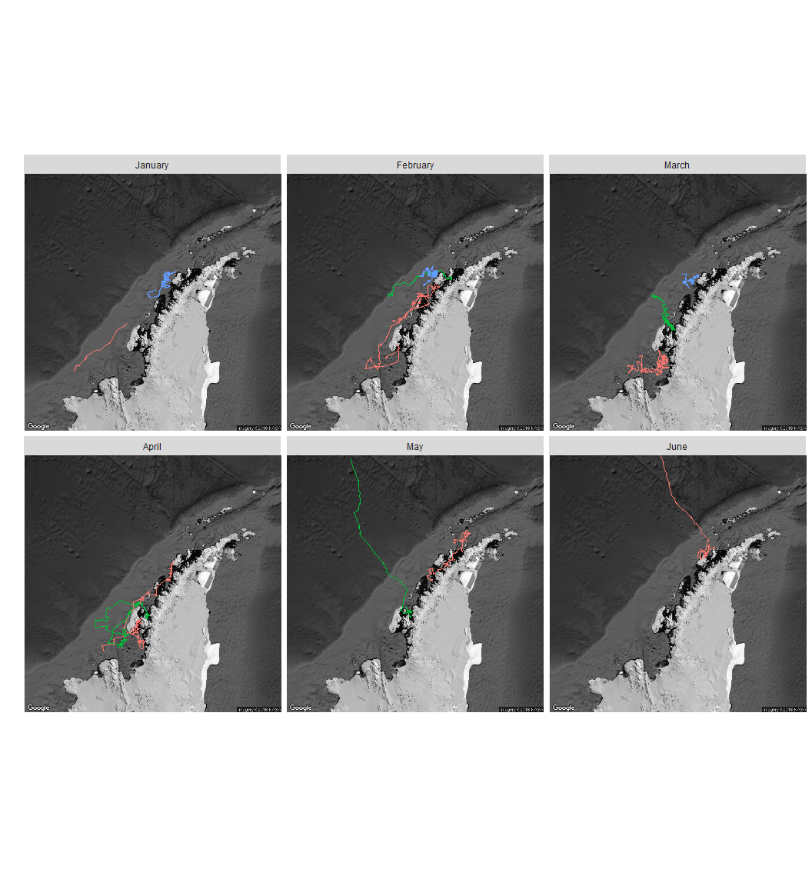<!-- -->

#Correlated random walk

*Process Model*

$$ d_{t} \sim T*d_{t-1} + Normal(0,\Sigma)$$
$$ x_t = x_{t-1} + d_{t} $$

## Parameters

For each individual:

$$\theta = \text{Mean turning angle}$$
$$\gamma = \text{Move persistence} $$

For both behaviors process variance is:
$$ \sigma_{latitude} = 0.1$$
$$ \sigma_{longitude} = 0.1$$

##Behavioral States

$$ \text{For each individual i}$$
$$ Behavior_1 = \text{traveling}$$
$$ Behavior_2 = \text{foraging}$$

$$ \alpha_{i,1,1} = \text{Probability of remaining traveling when traveling}$$
$$\alpha_{i,2,1} = \text{Probability of switching from Foraging to traveling}$$

$$\begin{matrix}
  \alpha_{i,1,1} & 1-\alpha_{i,1,1} \\
  \alpha_{i,2,1} & 1-\alpha_{i,2,1} \\
\end{matrix}
$$


With the probability of switching states:

$$logit(\phi_{traveling}) = \alpha_{Behavior_{t-1}}$$

$$\phi_{foraging} = 1 - \phi_{traveling} $$

##Continious tracks

The transmitter will often go dark for 10 to 12 hours, due to weather, right in the middle of an otherwise good track. The model requires regular intervals to estimate the turning angles and temporal autocorrelation. As a track hits one of these walls, call it the end of a track, and begin a new track once the weather improves. We can remove any micro-tracks that are less than three days.
Specify a duration, calculate the number of tracks and the number of removed points. Iteratively.


How did the filter change the extent of tracks?

<!-- -->

<!-- -->

<!-- --><!-- -->


sink("Bayesian/Multi_RW.jags")
cat("
    model{
    
    #Constants
    pi <- 3.141592653589
    
    ##argos observation error##
    argos_prec[1:2,1:2] <- inverse(argos_sigma*argos_cov[,])
    
    #Constructing the covariance matrix
    argos_cov[1,1] <- 1
    argos_cov[1,2] <- sqrt(argos_alpha) * rho
    argos_cov[2,1] <- sqrt(argos_alpha) * rho
    argos_cov[2,2] <- argos_alpha
    
    for(i in 1:ind){
    for(g in 1:tracks[i]){
    
    ## Priors for first true location
    #for lat long
    y[i,g,1,1:2] ~ dmnorm(argos[i,g,1,1,1:2],argos_prec)
    
    #First movement - random walk.
    y[i,g,2,1:2] ~ dmnorm(y[i,g,1,1:2],iSigma)
    
    ###First Behavioral State###
    state[i,g,1] ~ dcat(lambda[]) ## assign state for first obs
    
    #Process Model for movement
    for(t in 2:(steps[i,g]-1)){
    
    #Behavioral State at time T
    logit(phi[i,g,t,1]) <- alpha_mu[state[i,g,t-1],Month[i,g,t]] 
    phi[i,g,t,2] <- 1-phi[i,g,t,1]
    state[i,g,t] ~ dcat(phi[i,g,t,])
    
    #Turning covariate
    #Transition Matrix for turning angles
    T[i,g,t,1,1] <- cos(theta[state[i,g,t]])
    T[i,g,t,1,2] <- (-sin(theta[state[i,g,t]]))
    T[i,g,t,2,1] <- sin(theta[state[i,g,t]])
    T[i,g,t,2,2] <- cos(theta[state[i,g,t]])
    
    #Correlation in movement change
    d[i,g,t,1:2] <- y[i,g,t,] + gamma[state[i,g,t],Month[i,g,t]] * T[i,g,t,,] %*% (y[i,g,t,1:2] - y[i,g,t-1,1:2])
    
    #Gaussian Displacement
    y[i,g,t+1,1:2] ~ dmnorm(d[i,g,t,1:2],iSigma)
    }
    
    #Final behavior state
    logit(phi[i,g,steps[i,g],1]) <- alpha_mu[state[i,g,steps[i,g]-1],Month[i,g,steps[i,g]-1]] 
    phi[i,g,steps[i,g],2] <- 1-phi[i,g,steps[i,g],1]
    state[i,g,steps[i,g]] ~ dcat(phi[i,g,steps[i,g],])
    
    ##	Measurement equation - irregular observations
    # loops over regular time intervals (t)    
    
    for(t in 2:steps[i,g]){
    
    # loops over observed locations within interval t
    for(u in 1:idx[i,g,t]){ 
    zhat[i,g,t,u,1:2] <- (1-j[i,g,t,u]) * y[i,g,t-1,1:2] + j[i,g,t,u] * y[i,g,t,1:2]
    
    #for each lat and long
    #argos error
    argos[i,g,t,u,1:2] ~ dmnorm(zhat[i,g,t,u,1:2],argos_prec)
    }
    }
    }
    }
    ###Priors###
    
    #Process Variance
    iSigma ~ dwish(R,2)
    Sigma <- inverse(iSigma)
    
    ##Mean Angle
    tmp[1] ~ dbeta(10, 10)
    tmp[2] ~ dbeta(10, 10)
    
    # prior for theta in 'traveling state'
    theta[1] <- (2 * tmp[1] - 1) * pi
    
    # prior for theta in 'foraging state'    
    theta[2] <- (tmp[2] * pi * 2)
    
    ##Move persistance
    # prior for gamma (autocorrelation parameter) in state 1

    #for each month
    for (m in 1:Months){

    #Intercepts
    alpha_mu[1,m] ~ dnorm(0,0.386)
    alpha_mu[2,m] ~ dnorm(0,0.386)
    
    gamma[2,m] ~ dbeta(1.5, 2)		## gamma for state 2
    dev[m] ~ dbeta(1,1)			## a random deviate to ensure that gamma[1] > gamma[2]
    gamma[1,m] <- gamma[2,m] + dev[m] 		## gamma for state 1
    }
    
    
    ##Behavioral States
    
    #Hierarchical structure across motnhs
    
    #Variance
    alpha_tau[1] ~ dt(0,1,1)I(0,)
    alpha_tau[2] ~ dt(0,1,1)I(0,)
    
    #Probability of behavior switching 
    lambda[1] ~ dbeta(1,1)
    lambda[2] <- 1 - lambda[1]
    
    ##Argos priors##
    #longitudinal argos error
    argos_sigma ~ dunif(0,10)
    
    #latitidunal argos error
    argos_alpha~dunif(0,10)
    
    #correlation in argos error
    rho ~ dunif(-1, 1)
    
    
    }"
    ,fill=TRUE)
sink()


```
##    user  system elapsed 
##    2.56    1.88  176.97
```


##Chains

```
##           used (Mb) gc trigger  (Mb) max used  (Mb)
## Ncells 1324023 70.8    3886542 207.6  3886542 207.6
## Vcells 8424733 64.3   25383828 193.7 49576290 378.3
```

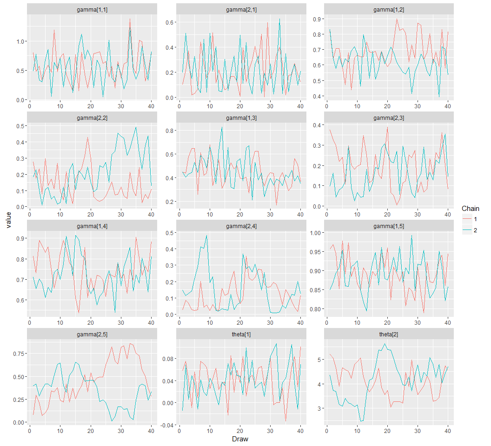<!-- -->


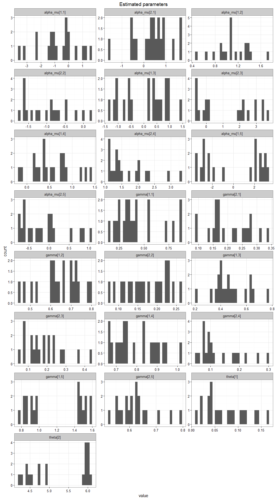<!-- -->

## Change in autocorrelation over time

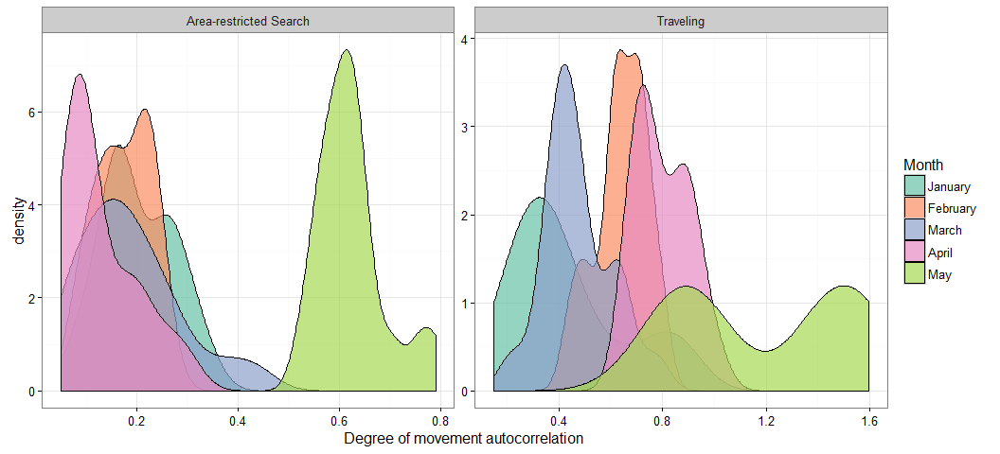<!-- -->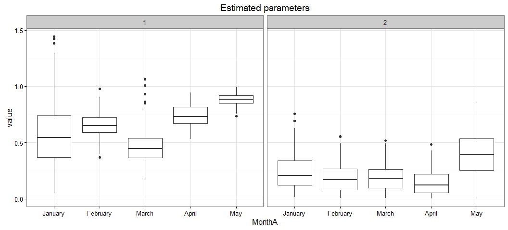<!-- -->

# Change in transition probabilities over time

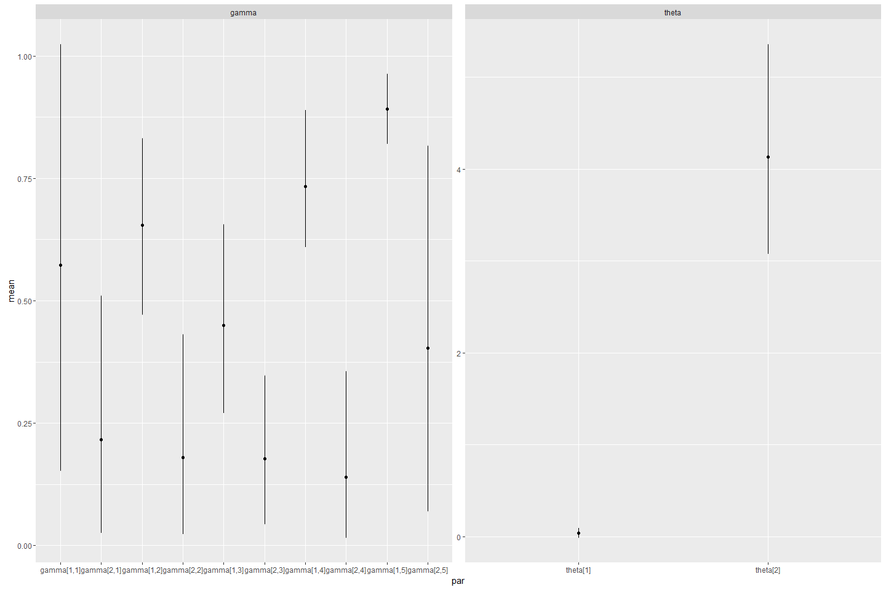<!-- -->

## Parameter Summary

```
##    parameter           par        mean       lower      upper
## 1   alpha_mu alpha_mu[1,1] -0.72468699 -3.18123755 1.28157414
## 2   alpha_mu alpha_mu[2,1]  0.38573938 -0.64178306 1.69489763
## 3   alpha_mu alpha_mu[1,2]  1.10539564  0.64274366 1.45018470
## 4   alpha_mu alpha_mu[2,2] -0.97832057 -1.64934873 0.03099899
## 5   alpha_mu alpha_mu[1,3]  0.04380359 -1.16549425 1.01744452
## 6   alpha_mu alpha_mu[2,3]  1.21421282 -0.61034886 3.44280925
## 7   alpha_mu alpha_mu[1,4]  0.56139964 -0.09068638 1.31888232
## 8   alpha_mu alpha_mu[2,4]  1.69692152  1.12976659 2.93533918
## 9   alpha_mu alpha_mu[1,5] -0.04484805 -3.40859886 3.06139801
## 10  alpha_mu alpha_mu[2,5] -0.11454987 -0.72707212 0.84448811
## 11     gamma    gamma[1,1]  0.43308990  0.20267828 0.87079269
## 12     gamma    gamma[2,1]  0.20324616  0.09077097 0.31367412
## 13     gamma    gamma[1,2]  0.64241258  0.46730684 0.79009039
## 14     gamma    gamma[2,2]  0.17373194  0.09105037 0.24032417
## 15     gamma    gamma[1,3]  0.47147917  0.31764284 0.65297282
## 16     gamma    gamma[2,3]  0.18630077  0.07116549 0.36809038
## 17     gamma    gamma[1,4]  0.80064762  0.66337443 0.94846666
## 18     gamma    gamma[2,4]  0.12929807  0.06093934 0.26581023
## 19     gamma    gamma[1,5]  1.19603192  0.83684136 1.59006069
## 20     gamma    gamma[2,5]  0.62390985  0.54961637 0.75809861
## 21     theta      theta[1]  0.07313205  0.01853568 0.14455211
## 22     theta      theta[2]  5.27477329  4.26999979 6.02154978
```

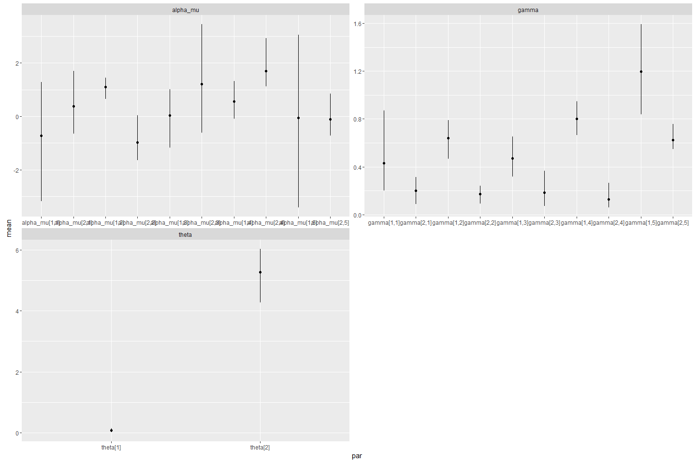<!-- -->

#Behavioral Prediction


##Autocorrelation in behavior

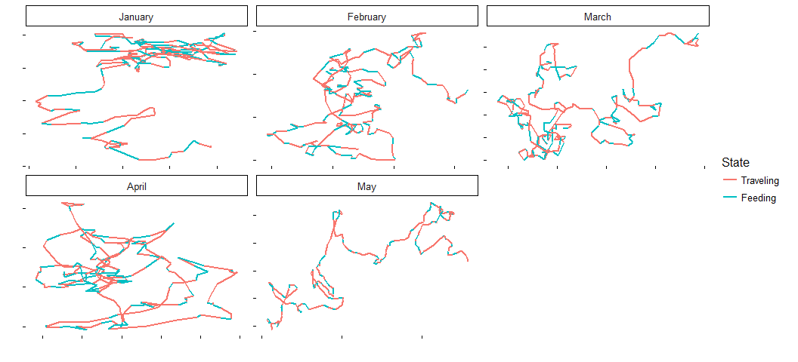<!-- -->

#Simulated tracks

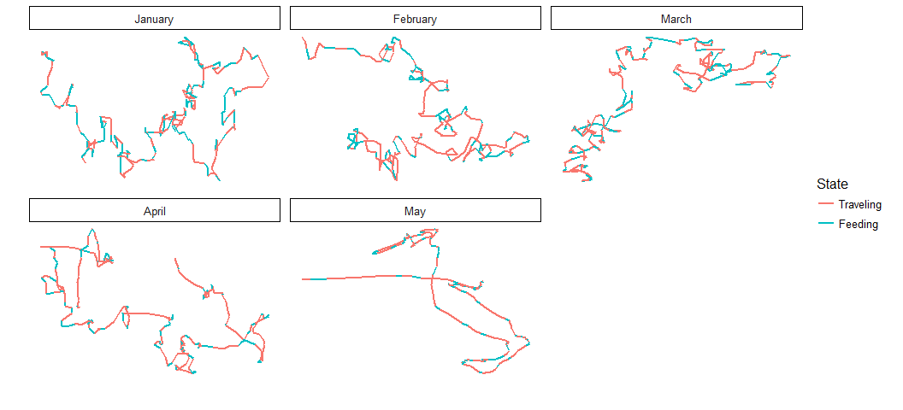<!-- -->

##Behavioral description

## Predicted behavior duration


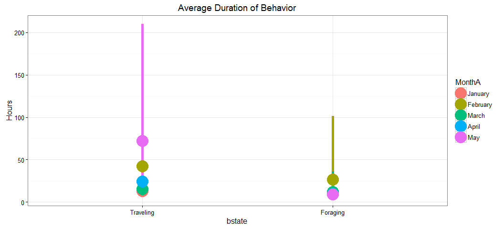<!-- -->

## Duration by month

<!-- -->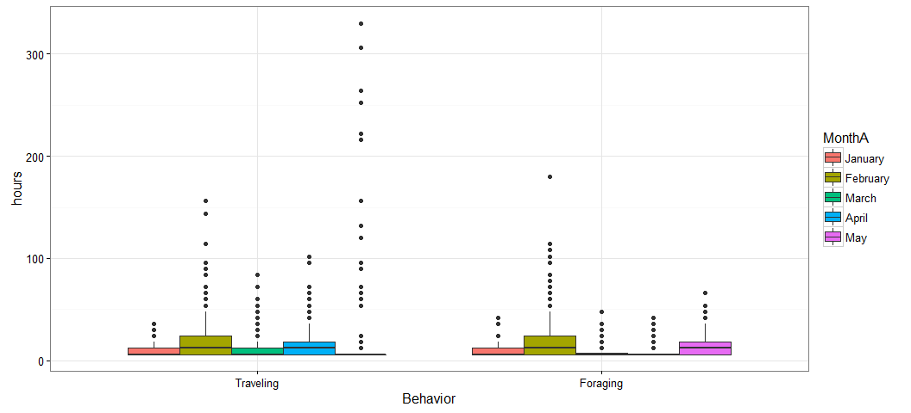<!-- -->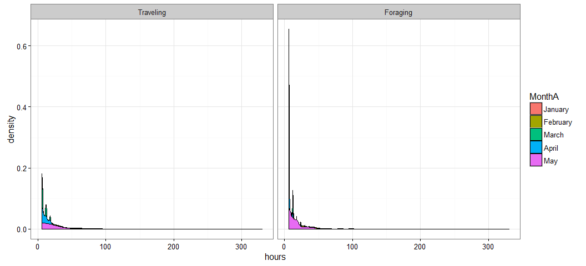<!-- -->


#Time spent in grid cell

<!-- -->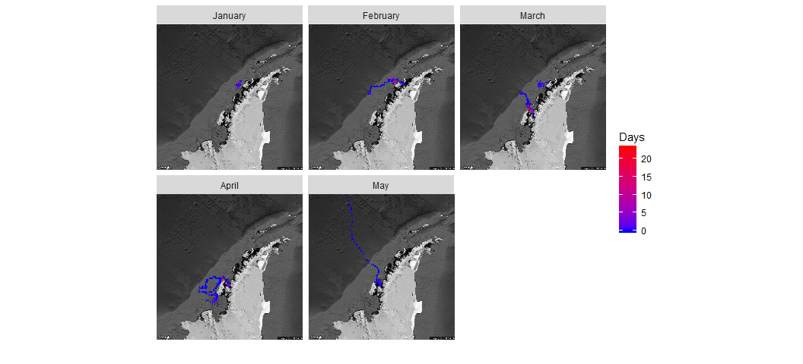<!-- -->


