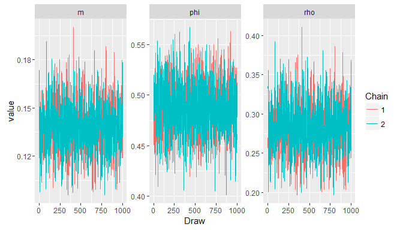
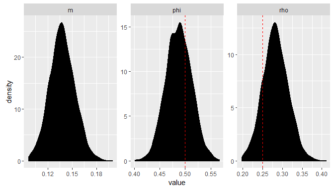
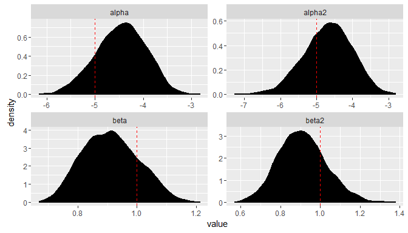

# Whale Bayes: On seperating predictors of occurrence and behavior in animal movement
Ben Weinstein  
`r Sys.time()`  


#Aim

A fundamental goal in ecology is to attribute the movement of animals across space and time to ecological mechanisms. Animals travel to find food, mates, shelter, and predator free space. Using individual data to parameterize movement models, ecologist have gained insight into animal distribution, migration, and behavior.Pinning down the causes and predictors of animal movement remains a challenging task for ecologists and conservation managers in a changing world. 

While there has been immense focus on describing movement processes, mechanisms, autocorrelation structures, and behavioral phases, it remains difficult to distinguish movement mechanisms across space and time. It is natural to assume that movement phases ('foraging', 'traveling', 'resting') are functions of the environment and life-history strategies. One glaring challenge is partitioning  species presence and behavior. Given that species must be present to participate in behavior, it is natural to assume that two processes are invariably linked. However, when we begin to think about predicting species behavior, we may spuriously conflate the predictors of animal behavior with the predictor of species presence. To date, all movement models assume that presence is given, and seek to extract the environment signatures of behavior based on logistic funtions and markov-models of state dependence. Our aim to step back and relate the huge body of movement ecology literature with the equally well-developed literature of species distribution modeling. We were inspired by the recent paper (Gravel) seeking to biotic interactions and distributions at scale. Our conceptual framework is based on Bayes Rule and statements of conditional probability.

# Simulation
Consider a grid of cells


Species presence at a given cell X is

$$ P(X=1) = 0.5 $$

The probability of species X existing in one of two behavior phases is:

$$ P(B=1) = 0.5 $$

Since we assume species movement stem from just two behavioral phases, the converse probability is:

$$ P(B=1) = 0.5 $$

Therefore the conditional probability of observing a species in cell X = [x,y] existing in behavioral phase B=1 is:

$$ P(B=1|X=1) = P(B=1) * B(X=1)$$

We can therefore model the joint probability of occurrence and behavior as arriving from seperate functions.

### Liklihood Analysis

Since we have a mixture of two processes, we can model the outcome occurrence and behavior state as a binomial and multinomial mixture model. For the sake of simplicity, we model just the probability of state = 1.


$$ X = Bernoulli(z)  $$
$$ z= \phi * \rho$$
$$ Occurrence \sim Bernoulli(\phi)$$
$$ Behavior \sim Bernoulli(\rho)$$


## Example 1: Random occurrence with random behavior with respect to space


sink("Bayesian/Intercept.jags")
cat("
model{

    #Liklihood

    for (cell in 1:cells){
      
      v[cell] ~ dbern(z[cell])

      z[cell]= X[cell] * rho 

      X[cell] ~ dbern(phi)
    }

    m=mean(z[])

    rho ~ dbeta(1,1)
    phi ~ dbeta(1,1)

    }"
    ,fill=TRUE)
sink()


```
##    user  system elapsed 
##    0.03    0.01   25.86
```



While this will work for simple cases, clearly as we see more complex functions, the probability of occurrence (phi) and the probability of behavior == 1 (rho) will become unidentifiable, and the liklihood landscape will not converge. 

The key value of interest is z, the joint probability of foraging given occurrence. Here the mean estimate is 0.14, very close to the true known value of 0.125 (which we can estimate using bayes rule).

As we increase the grid size (more data), we would converge on the true answer.

## Example 2: Environmentally dependent occurrence with random behavior

Moving towards the aim of analysis, let's continue with environmentally dependent occurrence, but environmentally independent behavior. We do not claim that behavior is itself random, but that the marginal probabilities of behavior are 0.5 with respect to the environmental conditions of the cell.

$$ X = Bernoulli(z)  $$
$$ z= \phi * \rho$$
$$ logit(\phi) = \alpha + \beta * environment $$


sink("Bayesian/Env.jags")
cat("
    model{
    
    #Liklihood
    
    for (cell in 1:cells){
    
    #Conditional Behavior
    v[cell] ~ dbern(z[cell])
    
    z[cell] <- rho * X[cell]
    #Occurrence
    X[cell] ~ dbern(phi[cell])
    
    #Occ function
    logit(phi[cell]) = alpha + beta * env[cell]  

    }
    
    #marginal probability
    m=mean(z[])

    #Priors
    alpha ~ dnorm(0,0.386)
    beta ~ dnorm(0,0.386)
    
    rho ~ dbeta(1,1)
    
    }"
    ,fill=TRUE)
sink()


```
##    user  system elapsed 
##    0.03    0.00    1.49
```


The critical thing to notice here is that while were able to parameterize a occurrence function (true state in dashed red lines), the probability of behavior is broadly centered on 0.5, with wide confidence intervals. This alerts us that the behavior itself has little environmental influence. 

## Example 3: Environmentally dependent occurrence with environmentally dependent behavior

Moving towards the aim of analysis, let's continue with environmentally dependent occurrence, but environmentally independent behavior. We do not claim that behavior is itself random, but that the marginal probabilities of behavior are 0.5 with respect to the environmental conditions of the cell.

$$ X = Bernoulli(z)  $$
$$ z= \phi * \rho$$
$$ logit(\phi) = \alpha + \beta * environment $$
$$ logit(\rho) = \alpha_2 + \beta_2 * environment_2 $$

Where the environmental predictors for occurrence and behavior are different variables (eg. temperature, bathymetry).


sink("Bayesian/Env2.jags")
cat("
    model{
    
    #Liklihood
    
    for (cell in 1:cells){
    
    #Conditional Behavior
    v[cell] ~ dbern(z[cell])
    
    z[cell] <- rho[cell] * X[cell]
    #Occurrence
    X[cell] ~ dbern(phi[cell])
    
    #Occ function
    logit(phi[cell]) = alpha + beta * env[cell]  
    
    #Behavior 
    logit(rho[cell]) = alpha2 + beta2 * env2[cell]  

    }
    
    #marginal probability
    m=mean(z[])
    
    #Priors
    alpha ~ dnorm(0,0.386)
    beta ~ dnorm(0,0.386)
    
    alpha2 ~ dnorm(0,0.386)
    beta2 ~ dnorm(0,0.386)    
    }"
    ,fill=TRUE)
sink()


```
##    user  system elapsed 
##    0.03    0.02  112.25
```



The critical thing to notice here is that while were able to parameterize a occurrence function (true state in dashed red lines), the probability of behavior is broadly centered on 0.5, with wide confidence intervals. This alerts us that the behavior itself has little environmental influence. 

We want to stress that in no way are we degraded the very excellent work by many movement ecologists, and especially the designers of the moveHMM package. The model being tested was not developed with such a mixture in mind. Nor are we claiming that the divide among occurrence and behavior was unknown. Instead we aim to link two parts of ecological thought, which we hope will motivate continued development within these communities. 

